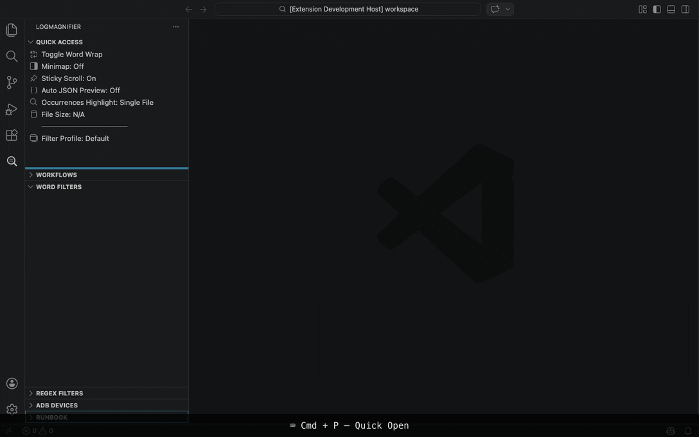
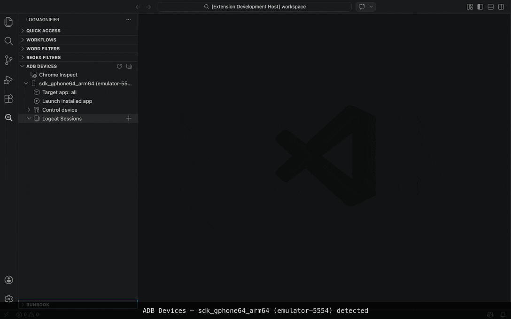
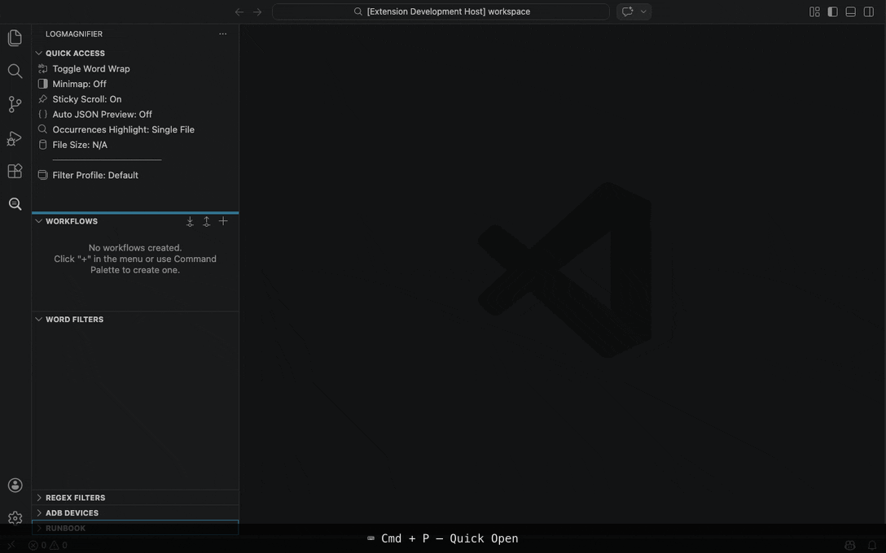
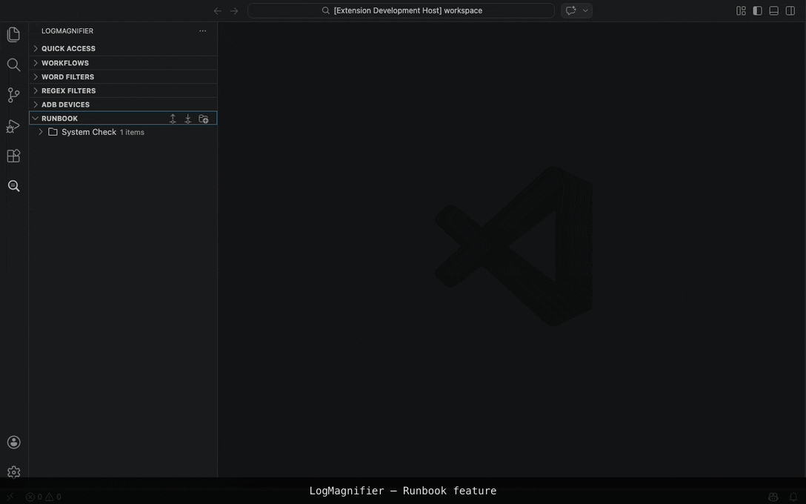
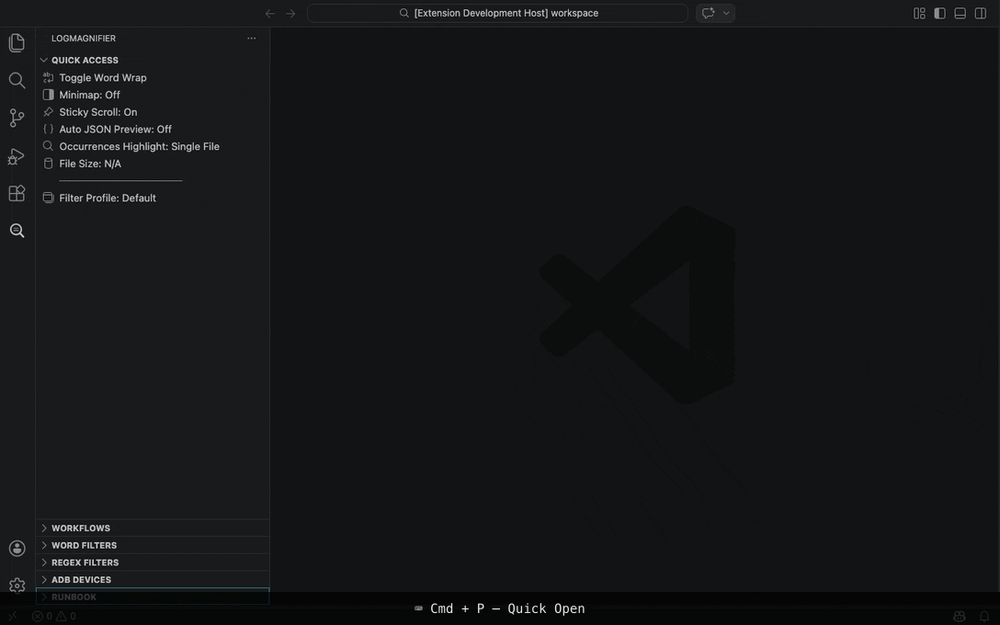
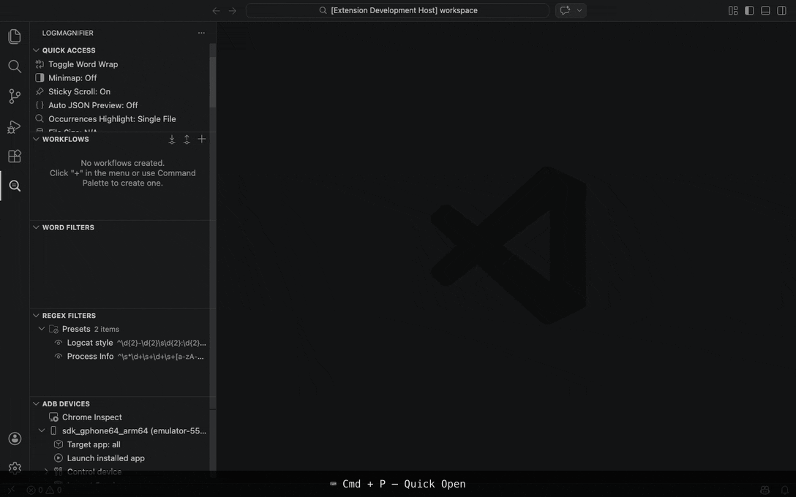

# LogMagnifier

[](https://marketplace.visualstudio.com/items?itemName=webispy.logmagnifier)
[](https://marketplace.visualstudio.com/items?itemName=webispy.logmagnifier)
[](https://github.com/webispy/vscode-logmagnifier/actions/workflows/package.yml)
[](https://app.codecov.io/github/webispy/vscode-logmagnifier)

A powerful log analysis tool for Visual Studio Code, featuring advanced log filtering and diverse highlighting options.



## Features

- **Filter Groups**: Organize your analysis with named groups of filters.
- **Include/Exclude Logic**:
  - **Include**: Keep and highlight lines containing specific keywords.
  - **Exclude**: Remove lines containing specific keywords (highest priority) and display matches with a strike-through or hide them completely.
- **Match Counts**: Real-time count of keyword occurrences displayed in the sidebar.
- **Search Navigation**: Quickly navigate between matches using Previous/Next buttons in the sidebar.
- **Highlighting**: Automatically highlights include type keywords in the filtered view.
- **3-Stage Highlighting**: Toggle between Word, Line, and Full Line highlight modes.
- **Navigation Animation**: Visual flash effect when navigating to search matches (configurable).
- **Expanded Colors**: 17 distinct, high-visibility colors including a "Bold Only" (Color00) option.
- **Context Lines**: View matching lines with surrounding context (±3, ±5, ±9 lines).
- **Focus Mode**: Generates a new editor tab with filtered results, enabling multi-stage filtering.
- **Regex Support**: Advanced filtering using regular expressions.
- **Drag & Drop**: Move filters between groups and reorder groups themselves with ease.
- **Organized Context Menus**: Intuitive submenus for managing filter types, case sensitivity, and highlight modes.
- **Selection to Filter**: Quickly add selected text as a new filter via the editor context menu.
- **Persistence**: Filters are automatically saved and restored when VS Code restarts.
- **Clear Data**: Commands to wipe persistent data for a fresh start — clear all at once or per-module (Filters, Bookmarks, Workflows, Runbook).
- **Import/Export**: Share and backup your filter configurations via JSON files.
- **Quick Access**: Toggle Word Wrap (active tab), Minimap, Sticky Scroll, and view File Size from the sidebar.
- **ADB Logcat Integration**: Directly view and filter Android logs within VS Code.
  - **Device Management**: View connected devices and their status.
  - **Process Filtering**: Filter logs by specific running applications (PID) automatically.
  - **Control Device**: Quickly take screenshots, record screen, and toggle 'Show Touches'.
  - **App Control**: Uninstall apps, clear storage, clear cache, and run dumpsys commands.
  - **Launch Installed App**: Select and launch any launchable app directly from the device tree.
  - **Session Management**: Create multiple logcat sessions with custom tag filters, priorities, and historical time toggles.
- **Log Bookmarks**: Bookmark important lines in your log files for easy reference and navigation.
  - **Add/Remove**: Toggle bookmarks via context menu.
  - **Keyword Tags**: Add custom tags to bookmarks for better organization.
  - **Navigate**: Jump to bookmarks instantly from the "LogMagnifier" view in the Panel.
  - **Word Wrap**: Toggle word wrap specifically for the bookmark view.
  - **Clear All**: Quickly remove all bookmarks for the current file.
  - **Persistence**: Bookmarks are saved and restored across sessions.
- **Log Analysis Workflows**: Automated, multi-step log analysis by chaining multiple filter profiles.
- **Runbook**: Manage and execute operational runbooks via an interactive, Markdown-based notebook interface with real-time webview output. Write documentation alongside executable shell code blocks, stop long-running commands, edit scripts inline, and share configurations via import/export.
- **Interactive JSON Preview**: Extract and explore JSON objects from log lines in a dedicated, searchable tree view (Ctrl+Cmd+J).
  - **Depth Control**: Incrementally expand or collapse JSON structure levels with persistent depth state.
- **Timestamp Analysis**: Automatic timestamp detection and time-based log navigation.
  - **Auto Detection**: Recognizes 8 built-in formats (ISO 8601, Apache, syslog, Android logcat, etc.).
  - **Time Range Explorer**: Hierarchical tree view (hour → 10min → minute) with density bar icons.
  - **Time Range Extract**: Extract log segments by time range via tree or editor context menus.
  - **Go to Timestamp**: Jump to a specific time (`Ctrl+Cmd+G`) with absolute (`HH:MM:SS`) or relative (`+5m`, `-30s`) input.
  - **Selection Gap Display**: Select multiple lines to see time gaps — gutter icons mark gaps, hover shows duration, status bar summarizes the selection.
- **File Hierarchy & Navigation**: Persistent tracking of relationships between original logs, filtered views, and bookmarks.
  - **CodeLens**: clickable "Original" and "Parent" links automatically appear at the top of filtered files.
  - **Tree View**: Visualize the full hierarchy (Original -> Filter -> Bookmark) in an indented tree (Ctrl+Cmd+T).
  - **Management**: Quickly remove items using the trash icon, with support for recursive deletion (deleting a root file removes all its derivatives).
  - **Persistence**: Navigation links and hierarchy are preserved even after restarting VS Code.

## Usage

### File Hierarchy & Navigation

1.  **CodeLens Navigation**:
    - When you apply a filter, the new temporary file will have links at the **top line**:
        - `[Original]`: Jump directly to the source log file.
        - `[Parent]`: Jump to the immediate parent file (e.g., if you filtered a filter).
        - `[Full Tree]`: Open the full hierarchy menu.
2.  **Full Tree View**:
    - Displays a recursive, indented tree view of all related files (Original, Filters, Bookmarks).
    - Select any item to jump to it.
    - Click the **Trash** icon on an item to remove it.
        - Deleting a parent (e.g., Original) will recursively remove all its children (Filters, Bookmarks).
3.  **Persistence**:
    - You can confidently "Close" filter tabs. When you re-open them (e.g., via Bookmarks), the hierarchy and navigation links are automatically restored.

### Filter View

1. **Open** "LogMagnifier" from the Activity Bar (LogMagnifier icon).
2. **Open Log File**: Open the log file you wish to analyze in the editor.
3. **Manage Filters**:
    - **Add Group**: Click the folder icon to create a new Filter Group (e.g., "AuthFlow").
    - **Expand/Collapse All**: Use the **Expand/Collapse** icons in the view title to manage all groups at once.
    - **Rename**: Right-click a group or a filter item to **Rename** its keyword.
    - **Bulk Actions**: Right-click a group to **Enable All Items** or **Disable All Items**.
    - **Copy**: Right-click a group to **Copy Enabled Items** as a list or tag format.
    - **Import/Export**: Use the Export and Import icons in the view title bar to backup or share your filters.
4. **Add Filters**: Activate the group, then click the **Plus** (`+`) icon to add a keyword.
    - *Tip*: Select text in the editor, right-click, and choose **Add Selection to LogMagnifier** to instantly create a filter.
    - *Tip*: Right-click items to access organized options like **Filter Type**, **Case Sensitivity**, **Highlight Mode**, and **Context Lines**.
    - *Tip*: Click the **Arrow Up/Down** icons on a filter item to navigate to the previous or next match in the editor.
    - *Tip*: Use keyboard shortcuts **`Ctrl + Cmd + ]`** (Next) and **`Ctrl + Cmd + [`** (Previous) to navigate matches of the selected filter.
5. **Apply**: Click the **Play** icon in the view title to generate filtered results.
    - *Tip*: Toggle the **List Icon** in the view title to include original line numbers in the output.
6. **Quick Access**: Use the **Quick Access** view to toggle editor settings (Word Wrap, Minimap, Sticky Scroll) or check the current file size.
    - *Tip*: Click the **File Size** item to cycle through units (Bytes, KB, MB).

### ADB Devices View



1.  **Devices**:
    - The "ADB Devices" view automatically lists connected Android devices.
    - **Select Target App**: Click the "Target app" item under a device to filter logs by a specific running application.
2.  **Control Device**:
    - **Screenshot**: Capture and view a screenshot of the device immediately.
    - **Screen Record**: Start/Stop screen recording. Videos are automatically pulled to your temp folder and opened.
    - **Show Touches**: Toggle visual feedback for taps on the device screen.
3.  **Control App**:
    - When a target app is selected, a "Control app" menu appears.
    - **Actions**: Uninstall, Clear Storage, or Clear Cache for the selected application.
    - **Dumpsys**: Access `package`, `meminfo`, and `activity` dumps directly from the sidebar.
4.  **Sessions**:
    - **Create Session**: Click the `+` icon on "Logcat Sessions" or run "Add Logcat Session".
    - **History Toggle**: Toggle the clock icon on a session to switch between "Start from now" and "Show full history".
    - **Add Tags**: Right-click a session to add specific tag filters (e.g., `MyApp:D`).
    - **Start/Stop**: Use the Play/Stop icons to control log capture.
    - **Output**: Logs are streamed to a new editor document with a detailed header.

### Log Analysis Workflows



1.  **Automation**: Chain multiple profiles to analyze complex issues from various angles sequentially.
2.  **Cumulative Filtering**: Each step in a workflow inherits filtered results from previous steps (Step N = Profile N applies to results of Step 0..N-1).
3.  **Manage Workflows**:
    - Click the **Workflows** icon (circuit board) in the activity bar.
    - **Create/Rename**: Manage your analysis scenarios as Workflows.
    - **Add Profiles**: Add existing Filter Profiles as steps. From the quick pick, create new profiles on the fly or rename/delete existing ones without leaving the workflow editor.
    - **Reorder**: Use the arrow icons to change execution order.
    - **Run**: Click the **Play** icon to execute all steps automatically.
4.  **Execution Feedback**: The sidebar visualizes step progress, indicating the currently active step and completion status.

### Runbook



1.  **Overview**:
    - Manage and execute your operational commands using an interactive, Markdown-based notebook interface.
    - Each Runbook is a `.md` file stored in your global storage. You can write documentation, instructions, and embed executable shell code blocks (`sh`, `bash`, `shell`).
2.  **Execution**:
    - **Open Interface**: Click a Runbook item in the sidebar to open the interactive Webview.
    - **Run**: Click the **Play** button next to a code block to execute it directly in the Webview with real-time streaming output.
    - **Stop**: While a command is running, the Play button becomes a **Stop** button — click it to kill the process.
    - **Clear**: After execution, click the **Clear** button to dismiss the output.
    - **Edit**: Click the **Edit** button to modify the script inline. Changes are automatically saved back to the Markdown file.
3.  **Organization**:
    - **Add Group**: Click the **Folder** icon in the Runbook view title to create a new group.
    - **Add Item**: Click the **+** icon inline on a group to add a new Markdown file inside it.
    - **Context Menu**: Right-click any Runbook or folder in the sidebar to **Rename**, **Delete**, or **Edit Markdown** source directly.
    - **Import/Export**: Use the **Export** and **Import** icons in the view title bar to backup or share runbook configurations as JSON.
    - **Storage**: Files are saved in the extension's `runbooks` global storage directory (`.../globalStorage/webispy.logmagnifier/runbooks`).

### JSON Preview



1.  **Open**: Press `Ctrl+Cmd+J` on a log line containing a JSON object to extract and display it in the JSON Preview view.
2.  **Explore**: Expand or collapse nodes in the tree view to navigate the JSON structure.
3.  **Depth Control**: Use the **+/-** icons to incrementally expand or collapse all nodes by one level at a time.
4.  **Search**: Use the search box to filter visible nodes by key or value.

### Timestamp Analysis

1.  **Auto Detection**: Open a log file with timestamps — the format is detected automatically and shown in the status bar.
2.  **Time Range Explorer**: Browse log distribution by time in the "Time Range Explorer" tree view. Click any node to jump to that time range.
3.  **Extract by Time Range**:
    - Right-click a tree node → **Extract This Time → End** or **Extract Start → This Time**.
    - Right-click in the editor → **Extract This Line → End** or **Extract Start → This Line**.
    - **Extract This Range** / **Extract Range ± Margin...** to extract a specific time window.
4.  **Go to Timestamp**: Press `Ctrl+Cmd+G` (or click the status bar) to jump to a specific time. Supports absolute (`14:30`, `14:30:05.123`) and relative (`+5m`, `-30s`) input.
5.  **Selection Gap Display**: Select multiple lines to analyze time gaps — clock icons appear in the gutter at gap locations, hover for details, and the status bar shows a summary.
6.  **Settings**: Configure via `logmagnifier.timestamp.enabled`, `autoDetect`, `customPatterns`, and `gapThreshold`.

### Log Bookmarks



1.  **Add Bookmark**:
    - Right-click a line in the editor and select **LogMagnifier > Add Line to Bookmark**.
    - Select text in the editor, right-click, and select **LogMagnifier > Add Selection Matches to Bookmark** to bookmark all matching lines in the file.
    - Right-click a filter item in the filter panel and select **Add Filter Matches to Bookmark** to bookmark all lines matched by that filter.
2.  **View Bookmarks**:
    - Open the "LogMagnifier" view in the panel (bottom panel).
    - Click any bookmark to jump to that line in the editor.
    - Click the 'x' icon to remove a bookmark.
3.  **Manage Bookmarks**:
    - **Quick File Switch**: Click the file tabs in the header to instantly jump between bookmarked files.
    - **Keyword Tags**: Bookmarks created via selection text or filter matches automatically carry the matched keyword as a tag, displayed next to the line number. Tags are grouped in the file header for quick filtering.
    - **Toggle Word Wrap**: Use the "Word Wrap" icon in the view title or `Alt+Z` (when view is focused) to toggle wrapping for long log lines.
    - **Clear All**: Use the "Clear All" icon to remove all bookmarks for the current file.
    - **Remove**: Click the 'x' icon to remove a single bookmark.
4.  **Persistence & Layout**:
    - Bookmarks are saved and restored across sessions.
    - **LIFO Ordering**: Newest bookmark files always appear at the top.
    - **Smart Scroll**: View maintains position and expanded/collapsed state for each file independently.

## Requirements

- VS Code 1.94.0 or higher.

## Extension Settings

This extension contributes the following settings:

* `logmagnifier.jsonPreview.enabled`: Enable automatic JSON preview update when active line changes. (Default: `false`)
* `logmagnifier.jsonPreview.maxLines`: Maximum number of lines to process for JSON preview. Selections exceeding this limit will be truncated. (Default: `10`)
* `logmagnifier.regex.enableHighlight`: Enable highlighting for Regex filters in the editor. (Default: `false`)
* `logmagnifier.regex.highlightColor`: Background color for Regex highlight. Can be a color string, a preset name, or an object with `light`/`dark` values.
* `logmagnifier.highlightColors.color00`: Special "Bold Only" style (no background color).
* `logmagnifier.highlightColors.color01` ... `color16`: Customizable light/dark mode colors for each highlight preset.
* `logmagnifier.tempFilePrefix`: Prefix for the filtered temp files. (Default: `filtered_`)
* `logmagnifier.statusBarTimeout`: Duration for status bar messages in milliseconds. (Default: 5000)
* `logmagnifier.adbPath`: Path to the adb executable. (Default: `adb`)
* `logmagnifier.adbLogcatDefaultOptions`: Default options for adb logcat command. (Default: `-v threadtime`)
* `logmagnifier.bookmark.maxMatches`: Maximum number of matches to add to bookmarks at once. (Default: `500`)
* `logmagnifier.removeMatches.maxLines`: Threshold for confirming removal of lines matching selection. (Default: `2000`)
* `logmagnifier.timestamp.enabled`: Enable timestamp analysis features. (Default: `true`)
* `logmagnifier.timestamp.autoDetect`: Automatically detect timestamp format when opening log files. (Default: `true`)
* `logmagnifier.timestamp.customPatterns`: Additional timestamp patterns for detection.
* `logmagnifier.timestamp.gapThreshold`: Minimum time gap in milliseconds to display in selection gap analysis. (Default: `1000`)

## Known Limitations

### Large File Support & Highlighting

LogMagnifier depends on VS Code's extension capabilities to provide highlighting and navigation. There are two levels of limitations for large files:

1.  **Restricted Mode (`editor.largeFileOptimizations`)**:
    * VS Code defaults to "restricted mode" for large files to allow them to open quickly. In this mode, extensions are disabled.
    * To enable Highlighting, Previous Match, and Next Match commands for these files, you must disable this optimization in your VS Code settings:
        ```json
        "editor.largeFileOptimizations": false
        ```
    * *Warning*: This may cause VS Code to freeze or perform slowly when opening very large files.

2.  **Extension Host Hard Limit (50MB)**:
    * Even with optimizations disabled, VS Code's extension host has a hard limit. Files larger than **50MB** are **not synchronized** to extensions ([reference](https://github.com/microsoft/vscode/issues/31078)).
    * For files > 50MB, **highlighting will not work** regardless of your settings because the text content is completely invisible to the plugin.
    * **Workaround**: Use the **Apply Filter** (Play button) feature. This streams the file content (bypassing the editor limit) and generates a smaller filtered log file where highlighting and navigation will work perfectly.

## Contributors

Thanks to the following people who have contributed to this project:

- [@birdea](https://github.com/birdea)
- [@JeanTracker](https://github.com/JeanTracker)
- [@HanDougChun](https://github.com/HanDougChun)

## Credits

All code in this project was written using **Google Antigravity** and **Claude Code**. Maintained by [webispy](https://github.com/webispy).
